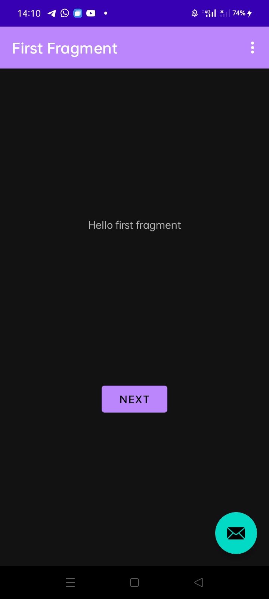
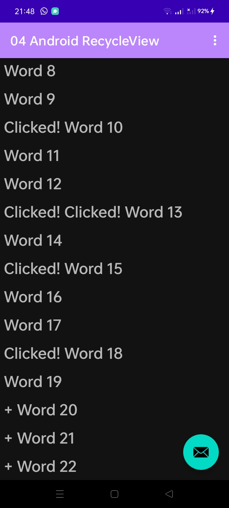

# 04-android-recycleview

## Task 1 : Create a new project and dataset

## Task 2 and 3 : Make the list interactive 

## Coding Challenges
Challenge 1: Change the options menu to show only one option: Reset. This option should return the list of words to its original state, with nothing clicked and no extra words.

Challenge 2: Creating a click listener for each item in the list is easy, but it can hurt the performance of your app if you have a lot of data. Research how you could implement this more efficiently. This is an advanced challenge. Start by thinking about it conceptually, and then search for an implementation example.

## Homework
- Use separate TextView elements and styling for the recipe name and description.
- You may use placeholder text for the full recipes.
- As an option, add an image for the finished dish to each recipe.
- Clicking the Up button takes the user back to the list of recipes.

