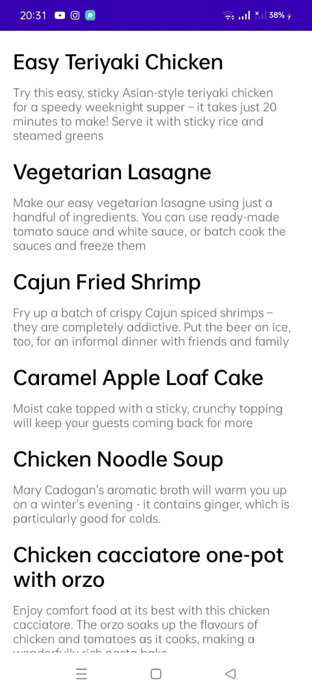
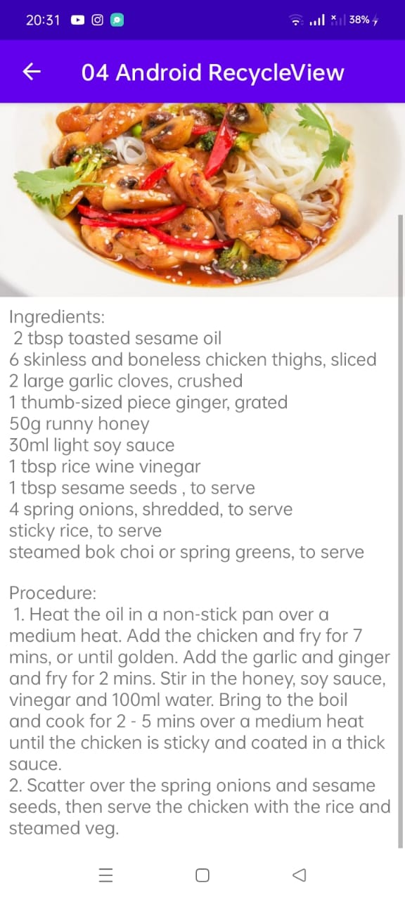

# 04-android-recycleview

## Task 1 : Create a new project and dataset

## Task 2 and 3 : Make the list interactive 

## Homework
- Use separate TextView elements and styling for the recipe name and description.
- You may use placeholder text for the full recipes.
- As an option, add an image for the finished dish to each recipe.
- Clicking the Up button takes the user back to the list of recipes.

